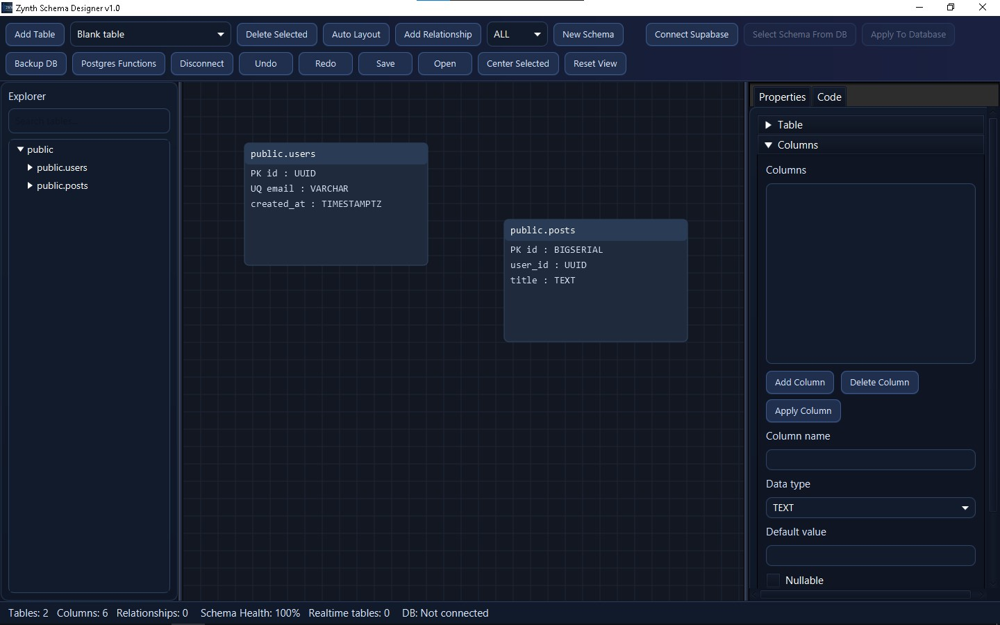
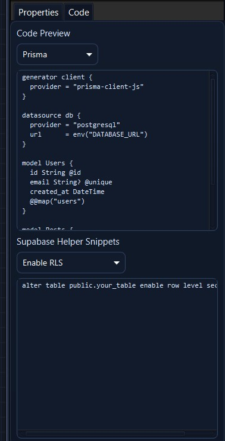

# Zynth Schema Designer v1.0.0

Zynth is a visual schema design platform for PostgreSQL and Supabase.  
It helps teams move from raw ideas to deployable schema output with fewer mistakes, clearer relationships, and faster iteration.




## What this project is all about

Database design is often fragmented:

- planning happens in docs or whiteboards
- SQL is written later in separate files
- migration decisions happen in another place again

Zynth is designed to remove that fragmentation.

You can model tables and relationships visually, edit constraints precisely, and see generated SQL/Prisma in real-time in one flow.  
The app is intentionally built to keep architecture, implementation, and release packaging tightly aligned.

## Who this is for

- **New developers** learning relational data modeling
- **Startup teams** iterating quickly on product schemas
- **Backend engineers** needing reliable SQL/Prisma output
- **Supabase builders** wanting connect/import/apply workflows
- **Tech leads** reviewing schema intent before rollout

## Why teams use Zynth

- Faster schema iteration with visual clarity
- Less rework from missing constraints and FK details
- Better communication between developers and reviewers
- Cleaner transition from design stage to executable schema code
- Portable `.zynth` project files for collaboration and continuity

## Core capabilities (deep breakdown)

### Visual schema modeling

- Drag and organize tables on canvas
- Relationship lines help surface data architecture quickly
- New tables are placed in non-overlapping positions
- New table creation auto-centers focus on the created entity

### Structured table and column editing

- Table controls: name, schema, realtime toggle
- Column controls: datatype, default value, nullable, PK, unique
- Advanced fields: ENUM type/value configuration and FK targeting

### Generation pipeline

- Live SQL DDL preview
- Live Prisma schema preview
- Migration diff mode for change inspection against baseline

### Database-assisted workflow

- Connect to PostgreSQL/Supabase through JDBC
- Import schema into visual workspace
- Scope to selected schema from connected database
- Apply generated SQL to connected database
- Export backup SQL for safety

### Productivity and navigation

- Undo/redo (`Ctrl+Z`, `Ctrl+Y`)
- Center selected table (`Ctrl+F`)
- Reset canvas zoom/pan (`Ctrl+0`)
- Stable locked layout for predictable panel behavior

## Local development

```powershell
cd "C:\Users\Administrator\Documents\ZYNTH"
mvn javafx:run
```

Alternative:

```powershell
.\run-zynth.bat
```

## Build and verify

```powershell
cd "C:\Users\Administrator\Documents\ZYNTH"
mvn clean test package
```

Expected artifact:

```text
target\zynth-schema-designer-1.0.0.jar
```

## Build Windows EXE

### Recommended (custom runtime + installer)

```powershell
cd "C:\Users\Administrator\Documents\ZYNTH"

jlink `
  --module-path "$env:JAVA_HOME\jmods" `
  --add-modules java.base,java.desktop,java.sql,javafx.controls,javafx.graphics `
  --strip-debug `
  --no-header-files `
  --no-man-pages `
  --compress=2 `
  --output target\runtime

jpackage `
  --type exe `
  --name ZynthSchemaDesigner `
  --app-version 1.0.0 `
  --input target `
  --main-jar zynth-schema-designer-1.0.0.jar `
  --main-class com.zynth.app.ZynthApp `
  --runtime-image target\runtime `
  --icon src\logo\logo.jpg `
  --dest target\release `
  --vendor "Zynth" `
  --description "Zynth Schema Designer for PostgreSQL and Supabase" `
  --win-menu `
  --win-shortcut `
  --win-dir-chooser `
  --win-per-user-install
```

### Fast one-line EXE command

```powershell
cd "C:\Users\Administrator\Documents\ZYNTH"
jpackage --type exe --name ZynthSchemaDesigner --app-version 1.0.0 --input target --main-jar zynth-schema-designer-1.0.0.jar --main-class com.zynth.app.ZynthApp --icon src\logo\logo.jpg --dest target\release --vendor "Zynth" --description "Zynth Schema Designer for PostgreSQL and Supabase" --win-menu --win-shortcut --win-dir-chooser --win-per-user-install
```

Output folder:

```text
target\release\
```

## Website / release links

- Project repository: `https://github.com/AstroNutws/ZYNTH/tree/main`
- Latest releases: `https://github.com/AstroNutws/ZYNTH/releases/latest`
- Landing page source: `index.html`

## Project layout

- `src/main/java/com/zynth/app/` - app shell and canvas behavior
- `src/main/java/com/zynth/model/` - schema domain model
- `src/main/java/com/zynth/generator/` - SQL and Prisma generators
- `src/main/java/com/zynth/io/` - persistence and DB I/O
- `src/main/resources/zynth-theme.css` - dark UI theme
- `src/logo/` - app icons (`logo.jpg`, `logo.png`, `logo.ico`)
- `requirements.md` - runtime/build requirements

## Maintainers / contributors

- AstronNutws
- Gab.Dev
- Joshua Gabriel De Leon
